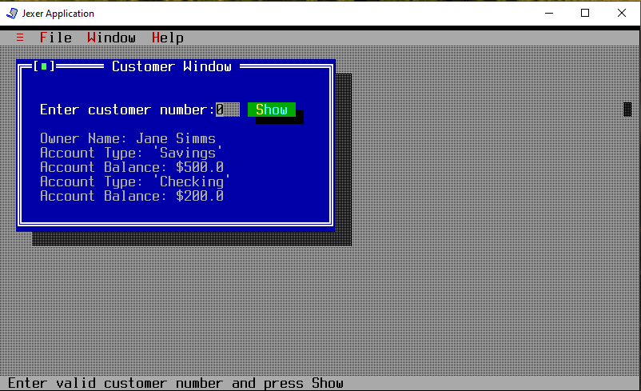
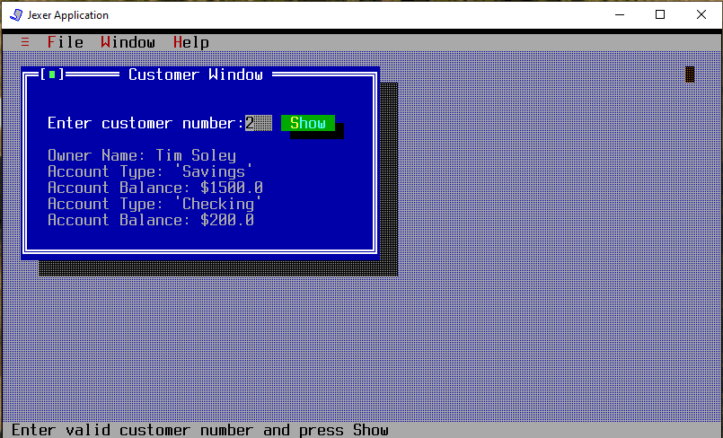
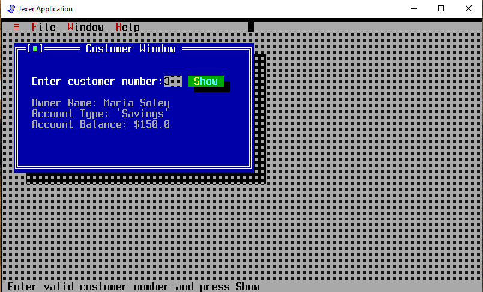

# UI Lab 1

Це одна з робіт, які доповнюють основний цикл лабораторних робіт #1-8 (проект **Banking**, [Netbeans](https://netbeans.org/)) з ООП.  Основна мета цих додаткових вправ - познайомитись з різними видами інтерфейсів користувача та засобами їх створення. 

## Завдання (на оцінку "п'ть"):
* Перепишіть метод ShowCustomerDetails з використанням класів Bank, Customer, Account та ін. з наших попередніх лаб.
* Інформація про клієнтів банку та їх рахунках має читатись з файлу test.dat. 
* Інформацію про клієнта (та про перший рахунок, що йому належить) ви маєте побачити, увівши номер клієнта.

## Результат

